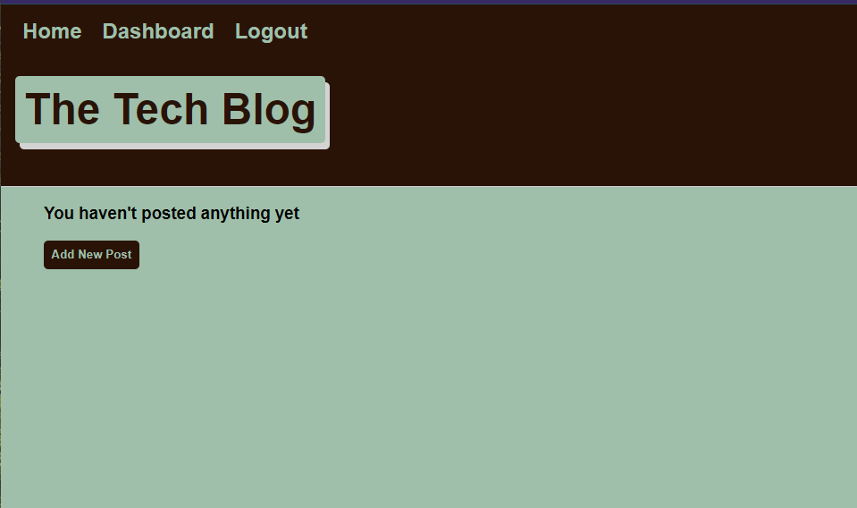

<h1 align='center'> Tech Blog 💻</h1>
  

  
  
  

    
    
    
    

     
  ## Description 📜
   A CMS-style blog site similar to a Wordpress site, where developers can publish their blog posts and comment on other developers’ posts as well!

   

  ## Table of Contents
  - [Description](#description)
  - [Installation](#installation)
  - [Contributing](#contributing)
  - [Questions](#questions)

  ## Installation 💾

  `npm start server`

  ## Contributing 👨‍💻
  Calvin Donner

  ## GitHub :octocat:
  [Calvin Donner](https://github.com/calvinjdonner)

  ## Questions ❓
  Email me with questions or concerns at calvinjdonner@gmail.com
   
 